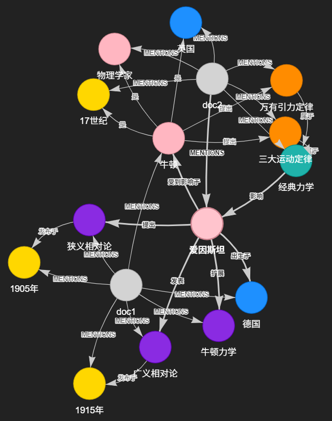
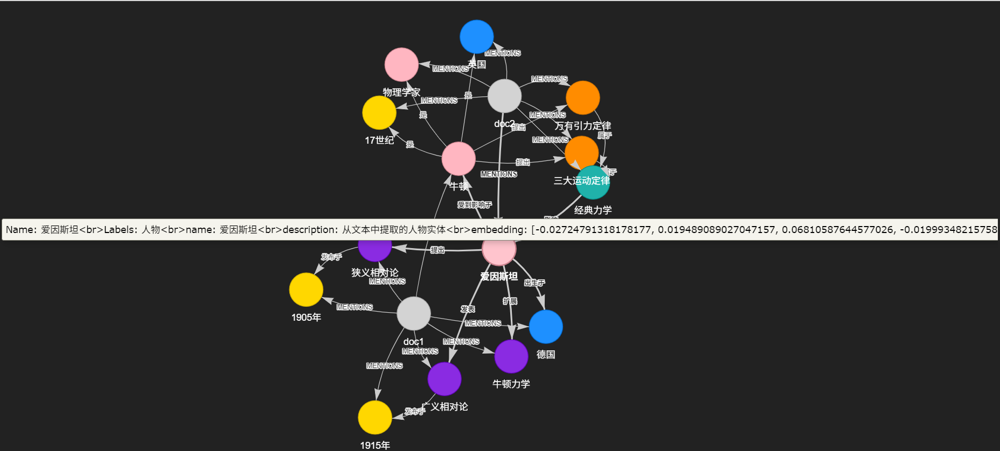
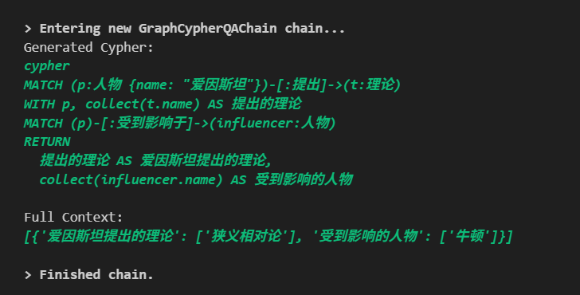

# RAG demo
基于Langchain测试 RAG 流程  


## 文件夹结构

    ├── RAG_demo
    │   ├── datasets                        # pdf 测试数据集
    │   ├── db
    │   │   ├── chroma_db                   # 向量数据库 chroma
    │   │   ├── faiss_db                    # 向量数据库 faiss
    │   │   └── law_db                      # 法律向量数据库 faiss 

    │   ├── model                           # 存储下载的模型
    │   ├── src
    │   │   ├── tools    
    │   │   │   ├── install_pkgs.ipynb      # 配置环境                
    │   │   ├── test                        # 测试代码
    │   │   ├── graph                       # neo4j 知识图谱
    │   │   ├── Embedding.ipynb             # 加载emb模型将chunk数据存为向量数据库  
    │   │   ├── Embedding.py                #（导出的py，readonly）
    │   │   ├── LoadData.ipynb              # 加载数据 chunk
    │   │   ├── LoadData.py                 #（导出的py，readonly）
    │   │   ├── models.ipynb                # langchain+vllm 构建模型生成逻辑
    │   │   ├── models.py                   #（导出的py，readonly）
    │   │   ├── st_app.py                   # streamlit 交互式 Web 测试模型 
    │   │   ├── tool.py                     # Python 装饰器
    │   │ 
    │   ├── .gitignore
    │   ├── README.md
    │   └── requirements.txt

## 核心逻辑

### 无论底层用的是 FAISS、Chroma 还是其他，LangChain 都会封装它们的相似性搜索逻辑，对外提供一致的检索接口

    # vector_db 是初始化的向量数据库实例（ Chroma、FAISS 或其他 LangChain 支持的向量存储）。

    # as_retriever() 是 LangChain 提供的统一接口，用于将向量数据库转换为 “检索器”（Retriever）

    retriever = vector_db.as_retriever(search_type='similarity', search_kwargs={'k': top_k})

### LangChain 的 QA 链，作用是将 “检索器（Retriever）” 和 “大语言模型（LLM）” 串联起来

    chain = RetrievalQA.from_chain_type(llm=llm,
                                        chain_type="stuff",
                                        retriever=retriever,
                                        chain_type_kwargs={"prompt": prompt_template},
                                        return_source_documents=True)

## Embedding.ipynb  
* embedding model：BAAI/bge-small-zh
* vector_db:
保存和加载 Chroma 、Faiss、 Milvus 三种向量库
在modles里面测试三种不同向量库的搜索和召回


## Models.ipynb
本地部署:qwen 0.6b

在线模型:qwen plus

## Graph RAG

三种方式抽取实体和关系：
```
re（正则表达式） 基于明确字符规则匹配，处理结构化文本

spaCy（NLP 工具库） 实体识别（NER）、词性标注等功能，能理解文本语义（如自动识别 “北京” 是地名、“张三” 是人名），且无需从零训练模型

LLM（大语言模型）  处理复杂、模糊的需求（如 “提取用户提到的、需要优先解决的产品故障”），不仅能识别多义、小众术语，还能结合上下文做逻辑判断，甚至排除无效信息
```
### 原始文字:
```
doc1 = """爱因斯坦是一位著名的物理学家，1879年出生于德国。
        爱因斯坦在1905年提出了狭义相对论，1915年发表了广义相对论。
        爱因斯坦受到了牛顿的影响，但他的理论扩展了牛顿力学的适用范围。"""
            
doc2 = """牛顿是17世纪的英国物理学家，他提出了万有引力定律和三大运动定律。
这些理论为经典力学奠定了基础，影响了后来包括爱因斯坦在内的许多科学家。"""
```
### 生成知识图谱: 





可交互查看[neo4j graph](src/graph/neo4j_graph.html)

### Langchain **GraphCypherQAChain** 知识图谱检索：
 
prompt="爱因斯坦提出了什么理论？他受到了谁的影响？"


